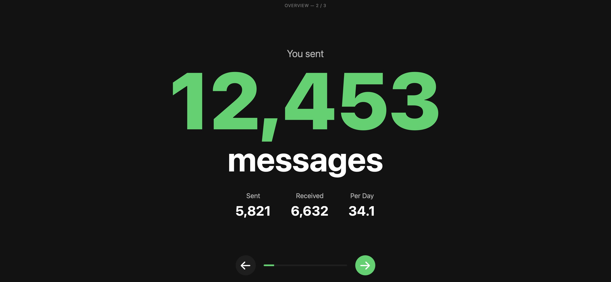
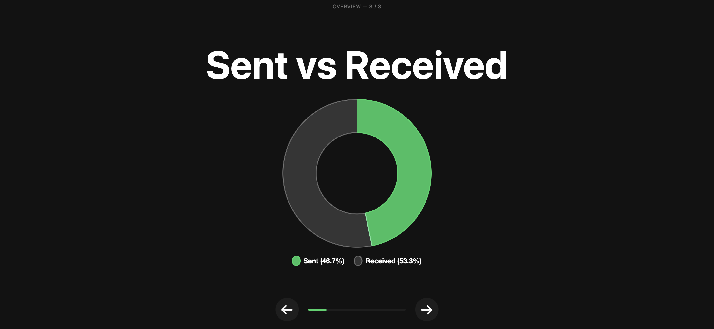
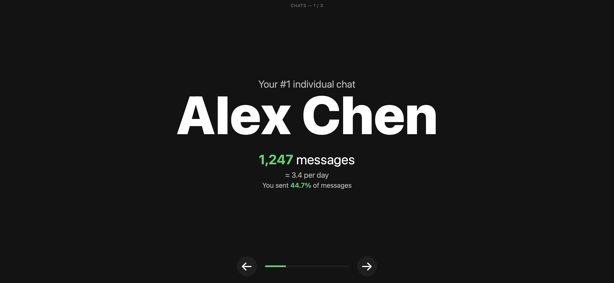
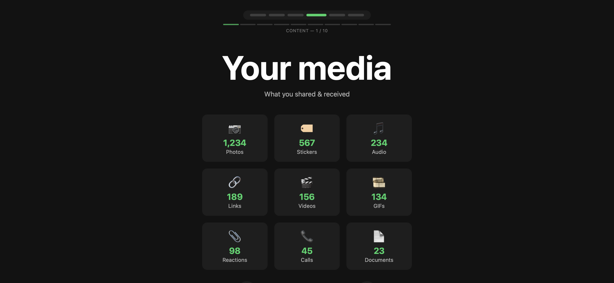
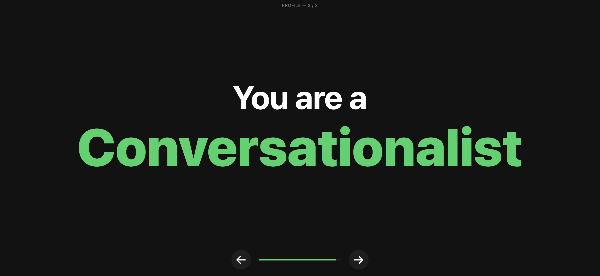

# WhatsApp Wrapped

[](https://opensource.org/licenses/MIT)
[](https://www.python.org/downloads/)
[](https://github.com/lukasss123/whatsapp-wrapped)

Generate Spotify Wrapped-style statistics for your WhatsApp conversations!

## Quick Start

### Prerequisites

1. **macOS or Windows** with the Apple Devices app (formerly iTunes)
2. **Python 3.9+**
3. **WhatsApp** installed on your iPhone with message history
4. An **iOS backup** of your iPhone (via Finder, iTunes, or Apple Devices app)

### Installation

```bash
# Install dependencies
pip install -r requirements.txt
```

### Usage

**List all iOS backups**
```bash
python whatsapp_wrapped_mvp.py --list-backups
```

**Automatic discovery (requires permissions)**
```bash
# Analyze 2025 (default year)
python whatsapp_wrapped_mvp.py

# Analyze a different year
python whatsapp_wrapped_mvp.py --year 2024

# Analyze all years
python whatsapp_wrapped_mvp.py --year 0
```

**Manual database path**
```bash
# Use a specific ChatStorage.sqlite file (extracted with iMazing, etc.)
python whatsapp_wrapped_mvp.py --db /path/to/ChatStorage.sqlite

# The file can be named anything - the script detects SQLite databases
python whatsapp_wrapped_mvp.py --db /path/to/7c7fba66680ef796b916b067077cc246adacf01d

# Custom output file
python whatsapp_wrapped_mvp.py --db /path/to/ChatStorage.sqlite --output my_stats.json
```

> **Note:** In iOS backups, files are renamed to SHA-1 hashes. The actual file is a SQLite database - you can use either the extracted `ChatStorage.sqlite` name or the hashed filename directly from the backup.

The script will:
1. 🔍 Find your iOS backups automatically (or use provided path)
2. 📱 Extract WhatsApp database from the most recent backup
3. 📊 Analyze your messages and generate statistics
4. 💾 Save results to JSON and HTML files
5. 🎉 **Open the HTML file in your browser** to see your Wrapped!

### Demo

Want to see what it looks like without running it? Check out the [demo output](examples/demo_wrapped.html) in your browser or [view the sample data](examples/demo_stats.json).







### What You'll Get

**Two output files:**

1. **JSON file** (`whatsapp_wrapped_stats.json`) - Raw statistics data
2. **HTML file** (`whatsapp_wrapped_stats.html`) - Beautiful interactive visualization!

**Statistics included:**
- **Total messages** sent and received
- **Top 3 individual chats** - Your most active 1-on-1 conversations
- **Top 3 group chats** - Your most active group conversations
- **Peak messaging hours** - when you chat the most
- **Day of week patterns** - your most active days
- **Personality classification** - Are you a Night Owl? Early Bird? Conversationalist?
- **Interactive charts** powered by Chart.js

**Controls for HTML visualization:**
- **Keyboard**: Arrow keys (← →) or Spacebar
- **Touch**: Swipe left/right on mobile
- **Mouse**: Click prev/next buttons

### Requirements for iOS Backup

#### Create an iOS Backup:

1. Connect iPhone to Mac
2. Open **Finder** (macOS Catalina+) or **iTunes** (older macOS)
3. Select your iPhone
4. Click **"Back Up Now"**
5. **Important**: For this MVP, use an **unencrypted backup**
   - Uncheck "Encrypt local backup" if prompted
   - (Encrypted backup support coming in full version)

#### Where Backups are Stored:

**macOS**
```
~/Library/Application Support/MobileSync/Backup/
```

**Windows (Apple Devices app)**
```
C:\Users\<YourName>\Apple\MobileSync\Backup
```

### Privacy & Security

- ✅ **100% local processing** - no data sent anywhere
- ✅ **No cloud uploads** - everything stays on your computer
- ✅ **Read-only access** - your backup is never modified
- ✅ **Open source** - inspect the code yourself

## Roadmap

- [x] MVP: Basic iOS analysis with core metrics
- [ ] HTML visualization (Wrapped-style slides)
- [ ] Encrypted iOS backup support
- [ ] Android support (msgstore.db)
- [ ] Media analytics (photos, videos, voice notes)
- [ ] Emoji and sentiment analysis
- [ ] Flutter mobile app

## Troubleshooting

**"No iOS backups found"**
- Make sure you've created a backup using Finder/iTunes
- Check that backups exist at `~/Library/Application Support/MobileSync/Backup/`

**"WhatsApp database not found"**
- Ensure WhatsApp is installed on your iPhone
- Make sure you have WhatsApp message history
- Try creating a fresh backup

**"Permission denied"**
- Make sure the script has read access to your backup folder
- On macOS, grant Terminal "Full Disk Access" in System Settings → Privacy & Security
- Restart Terminal after granting permissions

## Technical Details

### iOS Database Structure

WhatsApp on iOS uses a SQLite database called `ChatStorage.sqlite` stored in the app's shared container. The MVP analyzes:

- **ZWAMESSAGE** table - all messages
- **ZWACHATSESSION** table - conversations and contacts
- Apple Core Data timestamps (seconds since 2001-01-01)

### Dependencies

- Standard library only for MVP! (sqlite3, pathlib, json, etc.)
- Full version will use: pandas, jinja2, rich, etc.

## License

MIT License - feel free to use and modify!

## Contributing

This is an early MVP. Contributions welcome!

## Acknowledgments

Inspired by [imessage-wrapped](https://github.com/vuciv/imessage-wrapped) - a project that brings the Wrapped experience to iMessage conversations.

