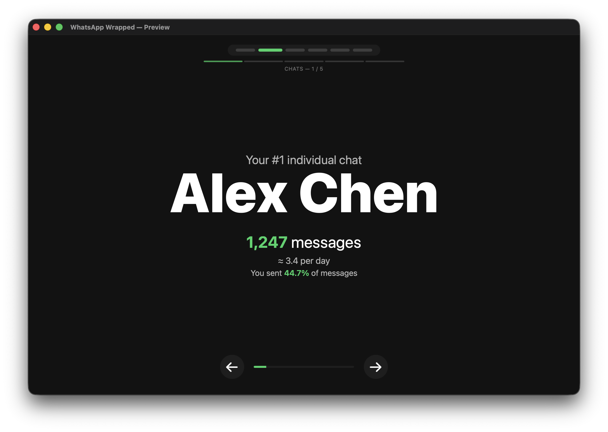
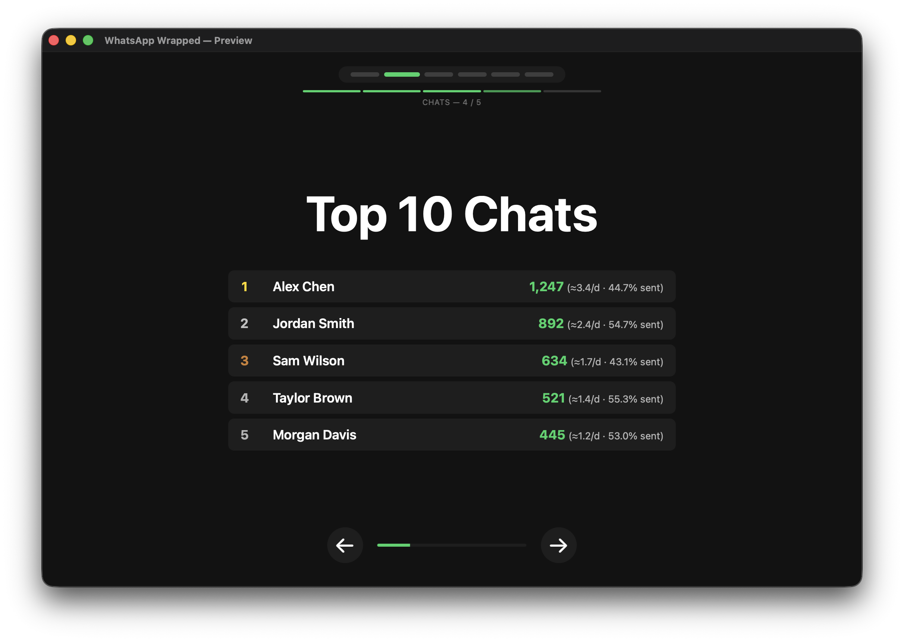
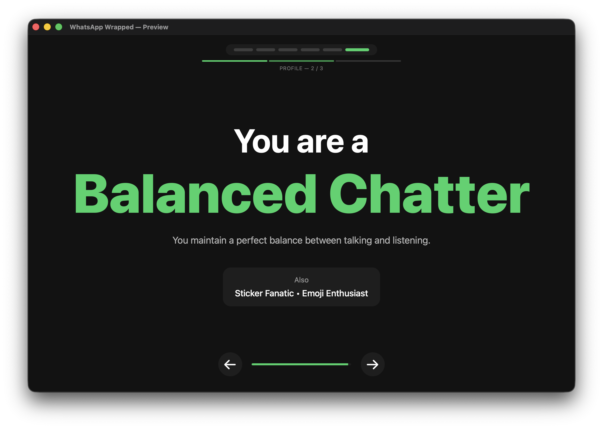

# WhatsApp Wrapped

[](https://opensource.org/licenses/MIT)
[](https://www.python.org/downloads/)
[](https://github.com/quantum3rror/whatsapp-wrapped)

Generate Spotify Wrapped-style statistics for your WhatsApp conversations!
This project was heavily inspired by Josh and his [video](https://www.youtube.com/watch?v=UhIxXC_5zmI) — his code is available [here](https://github.com/vuciv/imessage-wrapped).
This is a more polished version that opens in a dedicated window instead of outputting to an HTML file.
You simply need a backup from your iPhone on your Mac or Windows PC and can then generate your personal WhatsApp Wrapped with the provided application.

## Prerequisites

1. **macOS or Windows** with the Apple Devices app (formerly iTunes)
2. **iPhone with WhatsApp** and message history
3. An **unencrypted iOS backup** of your iPhone

#### Create an iOS Backup

1. Connect your iPhone to your computer
2. Open the appropriate app for your OS:
   - **macOS Catalina+** — Finder
   - **macOS older** — iTunes
   - **Windows** — Apple Devices (or iTunes for older versions)
3. Select your iPhone when it appears
4. Click **"Back Up Now"**
5. **Important**: Use an **unencrypted backup** — uncheck "Encrypt local backup" if prompted

#### Where Backups are Stored

**macOS**
```
~/Library/Application Support/MobileSync/Backup/
```

**Windows (Apple Devices app)**
```
C:\Users\<YourName>\Apple\MobileSync\Backup
```

## Getting Started

Download the latest **WhatsApp Wrapped.app** (macOS) or **WhatsApp Wrapped.exe** (Windows) from the [Releases page](https://github.com/quantum3rror/whatsapp-wrapped/releases).

**macOS — first launch**

macOS Gatekeeper will block an unsigned app. Right-click the `.app` → **Open** → **Open** to bypass the warning. You only need to do this once.

**Full Disk Access** (macOS)

The app reads your iOS backup folder, which requires Full Disk Access. If backups aren't found:

1. Open **System Settings → Privacy & Security → Full Disk Access**
2. Enable the toggle for **WhatsApp Wrapped** (or for **Terminal** when running from source)
3. Restart the app

**Using the app**

1. Launch **WhatsApp Wrapped**
2. Select the **year** you want to analyse and the **backup** to use
3. Click **Generate** — the Wrapped slides open automatically when analysis finishes

## Screenshots







Want to see what it looks like without running it? Check out the [demo output](examples/demo_wrapped.html) in your browser or [view the sample data](examples/demo_stats.json).

## What You'll Get

**Statistics included:**

- **Total messages** sent and received
- **Top 3 individual chats** — your most active 1-on-1 conversations
- **Top 3 group chats** — your most active group conversations
- **Peak messaging hours** — when you chat the most
- **Day of week patterns** — your most active days
- **Personality classification** — Night Owl? Early Bird? Conversationalist?
- **Interactive charts** powered by Chart.js

**Navigation controls (HTML visualization):**
- **Keyboard**: Arrow keys (← →) or Spacebar
- **Mouse**: Click prev/next buttons

---

## For Developers

### Running from source

```bash
pip install -r requirements.txt
```

**GUI app**
```bash
python gui.py
```

**CLI**

```bash
# List all iOS backups
python whatsapp_wrapped.py --list-backups

# Analyse 2025 (default year)
python whatsapp_wrapped.py

# Analyse a different year
python whatsapp_wrapped.py --year 2024

# Analyse all years
python whatsapp_wrapped.py --year 0

# Use a specific ChatStorage.sqlite file (e.g. extracted with iMazing)
python whatsapp_wrapped.py --db /path/to/ChatStorage.sqlite

# The file can be named anything — the script detects SQLite databases
python whatsapp_wrapped.py --db /path/to/7c7fba66680ef796b916b067077cc246adacf01d

# Custom output file
python whatsapp_wrapped.py --db /path/to/ChatStorage.sqlite --output my_stats.json
```

> **Note:** In iOS backups, files are renamed to SHA-1 hashes. The actual file is a SQLite database — you can use either the extracted `ChatStorage.sqlite` name or the hashed filename directly from the backup.

### Building with PyInstaller

> **Note:** PyInstaller builds must run on the target OS — you cannot cross-compile. Build on macOS for macOS, and on Windows for Windows.

#### macOS

**GUI app (`.app` bundle)**
```bash
pyinstaller WhatsAppWrapped-GUI.spec
# Output: dist/WhatsApp Wrapped.app
```

**CLI binary**
```bash
pyinstaller WhatsAppWrapped.spec
# Output: dist/WhatsAppWrapped
```

**Ad-hoc codesign** (silences Gatekeeper for local testing)
```bash
codesign --force --deep --sign - "dist/WhatsApp Wrapped.app"
```

#### Windows

Install dependencies first (run in PowerShell or Command Prompt):
```powershell
pip install -r requirements.txt
pip install pyinstaller pywebview
```

**GUI app (`.exe` + supporting files)**
```powershell
pyinstaller WhatsAppWrapped-GUI.spec
# Output: dist\WhatsApp Wrapped\WhatsApp Wrapped.exe
```

**CLI binary (single `.exe`)**
```powershell
pyinstaller WhatsAppWrapped.spec
# Output: dist\WhatsAppWrapped.exe
```

> **Windows WebView2 requirement:** The GUI app uses `pywebview` with the Edge/WebView2 backend. WebView2 is pre-installed on Windows 10 (1803+) and Windows 11. If it's missing, download the [WebView2 Runtime](https://developer.microsoft.com/microsoft-edge/webview2/) from Microsoft.

## Privacy & Security

- ✅ **100% local processing** — no data sent anywhere
- ✅ **No cloud uploads** — everything stays on your computer
- ✅ **Read-only access** — your backup is never modified
- ✅ **Open source** — inspect the code yourself

## Troubleshooting

**"No iOS backups found" (app)**
- Grant the app **Full Disk Access** in System Settings → Privacy & Security, then restart it
- Check that backups exist at `~/Library/Application Support/MobileSync/Backup/`

**"No iOS backups found" (CLI)**
- Make sure you've created a backup using Finder/iTunes
- On macOS, grant **Terminal** Full Disk Access in System Settings → Privacy & Security, then restart Terminal

**"WhatsApp database not found"**
- Ensure WhatsApp is installed on your iPhone with message history
- Try creating a fresh backup

**"Permission denied"**
- Make sure the app or script has read access to your backup folder
- See the Full Disk Access note above

## Technical Details

### iOS Database Structure

WhatsApp on iOS uses a SQLite database called `ChatStorage.sqlite` stored in the app's shared container. This tool analyses:

- **ZWAMESSAGE** table — all messages
- **ZWACHATSESSION** table — conversations and contacts
- Apple Core Data timestamps (seconds since 2001-01-01)

### Dependencies

- [Jinja2](https://jinja.palletsprojects.com/) — HTML template rendering
- [pywebview](https://pywebview.flowrl.com/) — native window for the GUI app
- Standard library: `sqlite3`, `pathlib`, `json`, etc.

## License

MIT License — feel free to use and modify!

## Contributing

This is an open source project. Contributions welcome!
